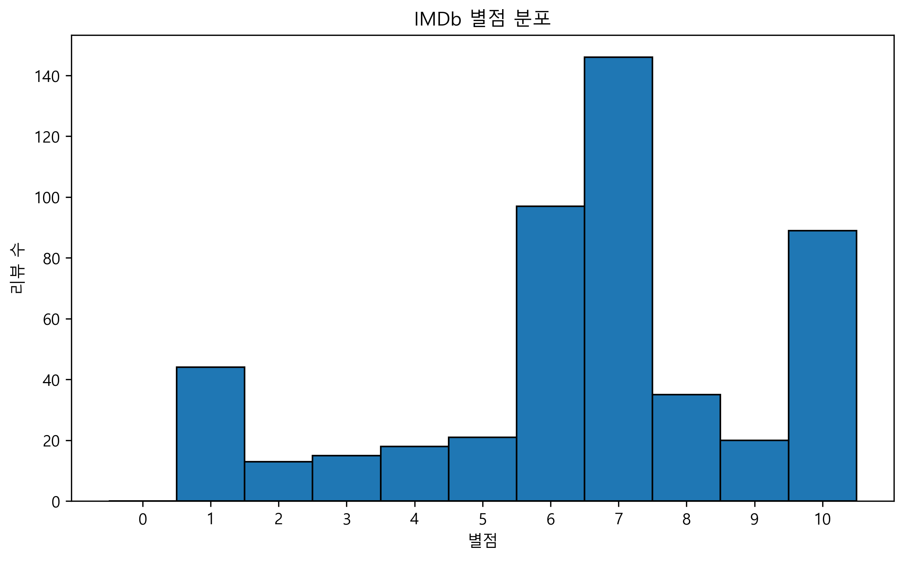
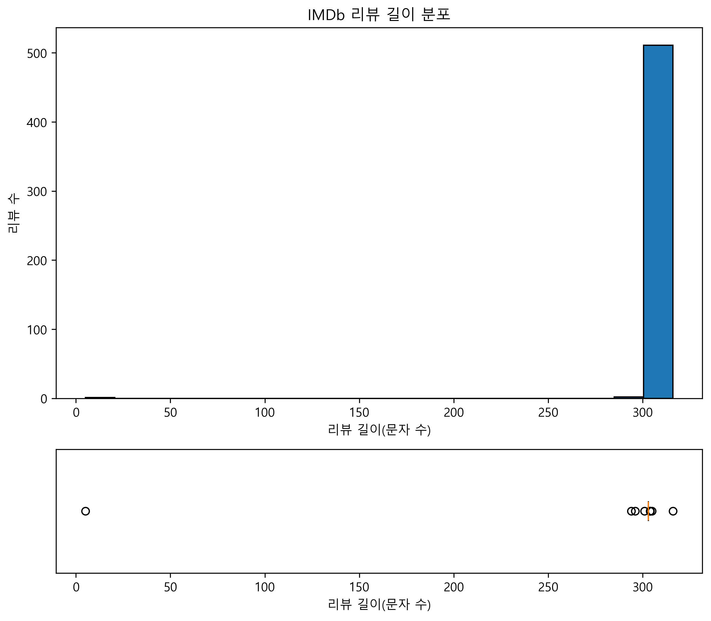
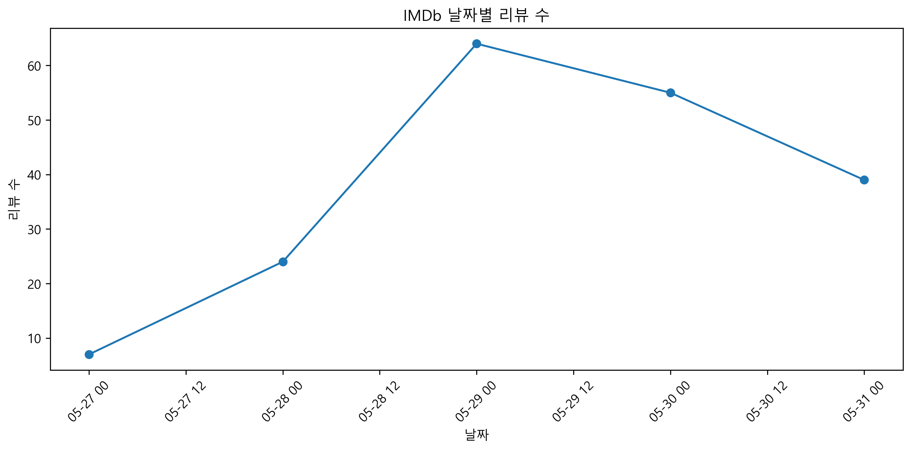
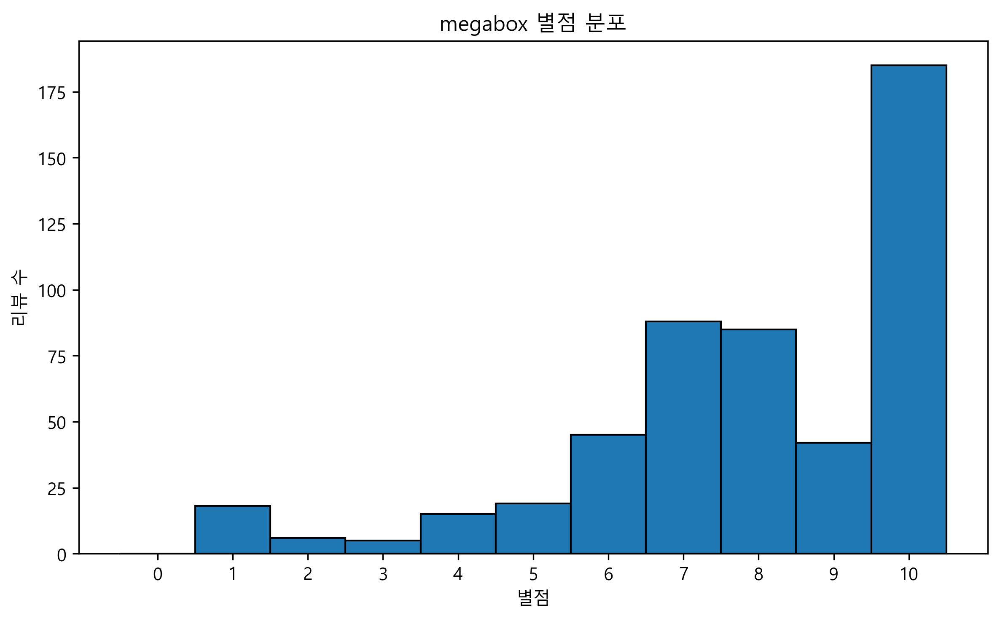
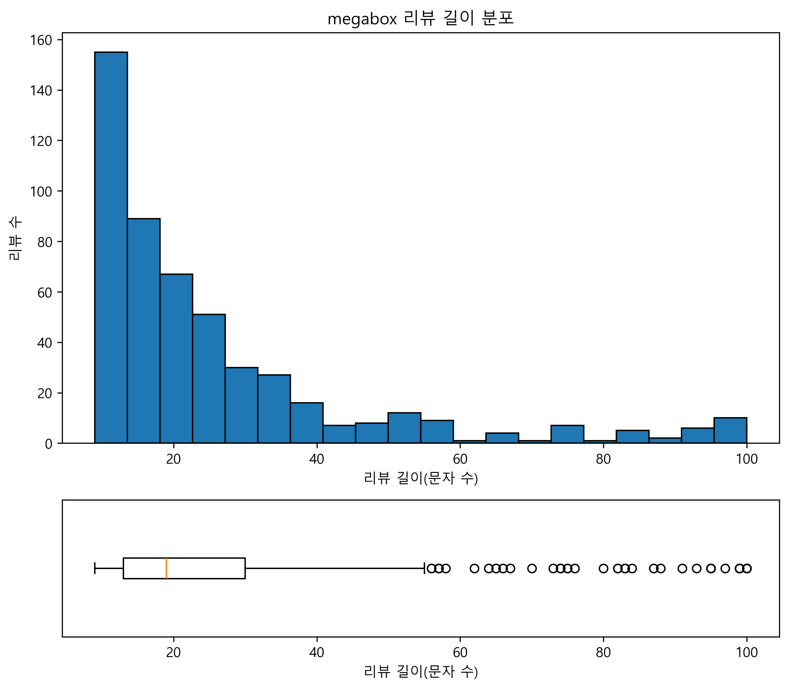
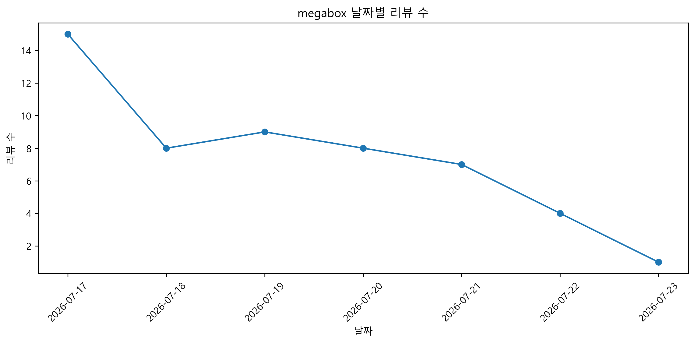
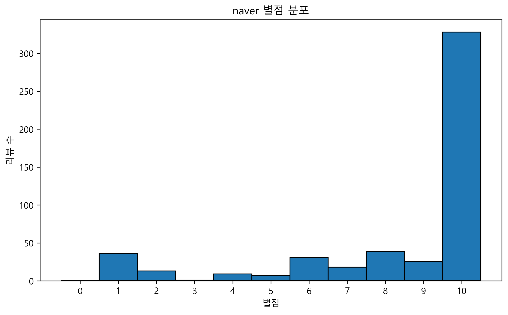
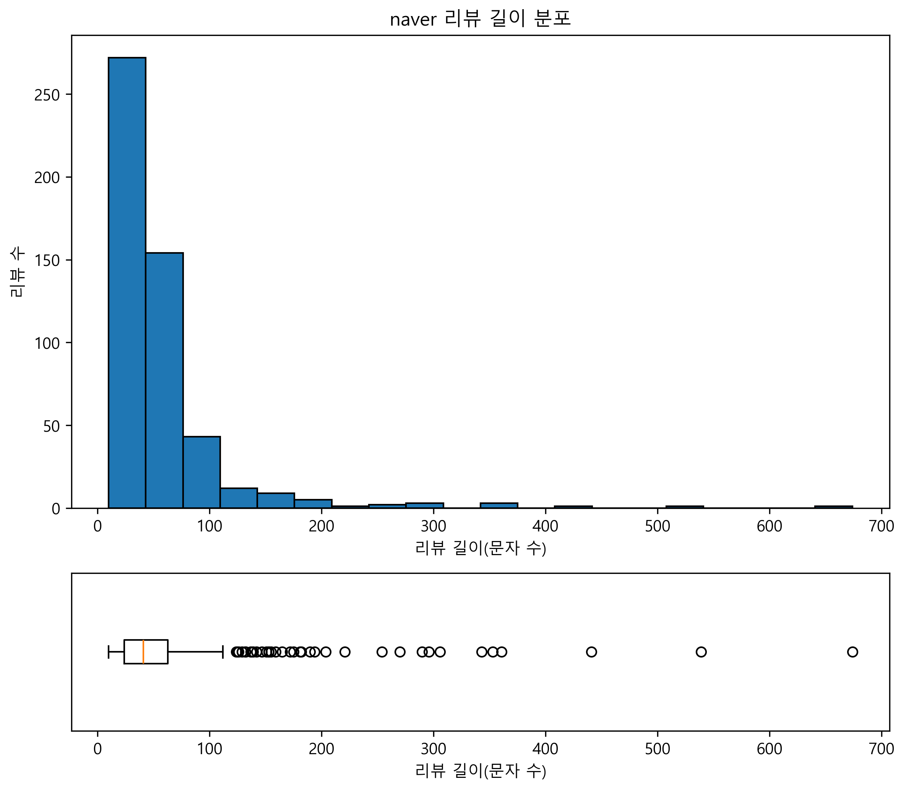
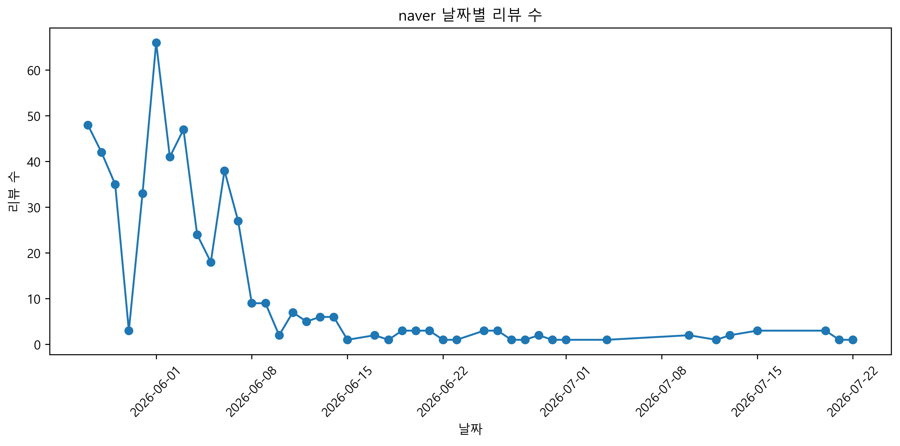

### 영화 <백룸> 리뷰 데이터 (IMDb)
* **데이터 소개:**
  * **크롤링 사이트 링크:** [IMDb The Backrooms User Reviews](https://www.imdb.com/title/tt26657236/reviews/?sort=submissionDate&dir=desc)
  * **데이터 형식:** 별점(10점 만점), 날짜(MMM DD, YYYY), 내용(텍스트, 최대 300자)이 포함된 CSV 형태
  * **수집 개수:** 약 500개 이상
* **실행 방법:**
  * review_analysis 터미널에서 다음 명령어를 실행
  * python crawling/main.py -o ../database --all
  * 만약 경로 문제 때문에 모듈을 찾을 수 없다고 뜨면, 대신 최상위 폴더에서 python -m review_analysis.crawling.main -o ./database --all 실행
  * (중요) 웹페이지가 켜지면, 30초 이내에 로그인해야 리뷰를 볼 수 있음. 실패시 로그인 할 준비하고 다시 명령어 실행
 

### 영화 <백룸> 리뷰 데이터 (Naver)
* **데이터 소개:**
  * **크롤링 사이트 링크:** [네이버 - 백룸 평점](https://search.naver.com/search.naver?where=nexearch&query=%EB%B0%B1%EB%A3%B8+%ED%8F%89%EC%A0%90)
  * **수집 방식:** 네이버 검색결과 관람평 위젯이 내부적으로 호출하는 JSON API(`nqapirender.nhn`, fileKey=movieKBPointAPI)를 직접 호출. 관람객(티켓 인증) 리뷰와 네티즌(비인증) 리뷰가 서로 다른 API 파라미터로 제공되어, 두 풀을 모두 수집한 뒤 `data-rating-id` 기준 중복 제거 후 합침
  * **데이터 형식:** 별점(score, 10점 만점), 작성일(date, YYYY.MM.DD HH:MM), 리뷰 내용(content), 작성자 ID(writer_id), 공감/비공감 수(like_count/dislike_count), 출처(source, 관람객/네티즌)가 포함된 CSV 형태
  * **수집 개수:** 507개 (관람객 리뷰 + 네티즌 리뷰 합산, 중복 제거)

### 영화 <백룸> 리뷰 데이터 (Megabox)
* **데이터 소개:**
  * **크롤링 사이트 링크:** [메가박스 - 백룸 관람평](https://www.megabox.co.kr/movie-detail/comment?rpstMovieNo=26027600)
  * **수집 방식:** Selenium으로 메가박스 관람평 페이지를 열고, BeautifulSoup으로 각 페이지의 리뷰 카드를 파싱하였다. 페이지네이션을 순차적으로 이동하며 별점, 리뷰 내용, 작성일을 수집하고, 별점·리뷰·날짜 조합을 기준으로 중복 리뷰를 제거하였다.
  * **데이터 형식:** 영화명(movie), 사이트명(site), 별점(rating, 10점 만점), 리뷰 내용(review), 작성일(date, YYYY-MM-DD)이 포함된 CSV 형태
  * **수집 개수:** 508개

 
### 데이터 전처리(preprocessing) 실행 방법
 * 과제 최상위 폴더에서 다음 명령어 실행: python -m review_analysis.preprocessing.main --all
 * db에 저장 확인

### EDA

세 사이트(IMDb, Megabox, Naver)의 원본 리뷰 데이터를 대상으로 별점 분포, 리뷰 길이 분포, 날짜 분포를 분석하고 데이터의 특성을 확인하였다.

---

#### 1. IMDb

##### 별점 분포

- 총 리뷰 수 : 514개
- 평균 별점 : 6.52점
- 중앙값 : 7점
- 별점 범위 : 1 ~ 10점
- 별점 이상치 : 없음 (0~10 범위를 벗어난 데이터 없음)
- 특징 : 리뷰가 6~8점 구간에 가장 많이 분포하며, 낮은 평점과 높은 평점도 일부 존재함.

##### 리뷰 길이 분포

- 평균 리뷰 길이 : 302.44자
- 중앙값 : 303자
- 최소 길이 : 5자
- 최대 길이 : 316자
- 리뷰 길이 이상치 : 18개 (IQR 기준)
- 특징 : 대부분의 리뷰가 약 300자 내외에 집중되어 있으며, 매우 짧은 리뷰가 일부 존재함.

##### 날짜 분포

- 리뷰 작성 기간 : 2026-05-27 ~ 2026-05-31
- 날짜 결측치 : 325개
- 미래 날짜 : 없음
- 특징 : 5월 29일에 가장 많은 리뷰가 작성되었으며 이후 감소하는 경향을 보임.

---

#### 2. Megabox

##### 별점 분포

- 총 리뷰 수 : 508개
- 평균 별점 : 7.86점
- 중앙값 : 8점
- 별점 범위 : 1 ~ 10점
- 별점 이상치 : 없음
- 특징 : 7~10점의 높은 평점이 대부분을 차지하여 전반적으로 긍정적인 평가가 많음.

##### 리뷰 길이 분포

- 평균 리뷰 길이 : 25.95자
- 중앙값 : 19자
- 최소 길이 : 9자
- 최대 길이 : 100자
- 리뷰 길이 이상치 : 44개 (IQR 기준)
- 특징 : 대부분의 리뷰가 10~30자 사이의 짧은 문장으로 작성되었으며, 일부 긴 리뷰가 존재함.

##### 날짜 분포

- 리뷰 작성 기간 : 2026-07-17 ~ 2026-07-23
- 날짜 결측치 : 456개
- 미래 날짜 : 없음
- 특징 : 7월 17일 이후 리뷰 수가 점차 감소하는 경향을 보임.

---

#### 3. Naver

##### 별점 분포

- 총 리뷰 수 : 507개
- 평균 별점 : 8.41점
- 중앙값 : 10점
- 별점 범위 : 1 ~ 10점
- 별점 이상치 : 없음
- 특징 : 10점 리뷰의 비중이 가장 높아 세 사이트 중 가장 긍정적인 평가를 보임.

##### 리뷰 길이 분포

- 평균 리뷰 길이 : 55.62자
- 중앙값 : 41자
- 최소 길이 : 10자
- 최대 길이 : 674자
- 리뷰 길이 이상치 : 37개 (IQR 기준)
- 특징 : 대부분의 리뷰는 20~60자에 분포하지만, 매우 긴 리뷰도 일부 존재함.

##### 날짜 분포

- 리뷰 작성 기간 : 2026-05-27 ~ 2026-07-22
- 날짜 결측치 : 0개
- 미래 날짜 : 없음
- 특징 : 개봉 직후 리뷰가 집중되었으며 이후 리뷰 수가 점차 감소하는 경향을 보임.

### 웹 과제 실행 방법
1. pip install -r requirements.txt
2. uvicorn app.main:app --reload
3. http://localhost:8000/static/index.html 접속 후 UI 확인

### 팀 소개
* 7조
* 팀장: 최성민
* 팀원: 박소영, 송지훈

### 자기소개
**최성민 (22, 응용통계학과)**
**박소영 (응용통계학과)**
**송지훈**
