### 영화 <백룸> 리뷰 데이터 (IMDb)
* **데이터 소개:**
  * **크롤링 사이트 링크:** [IMDb The Backrooms User Reviews](https://www.imdb.com/title/tt26657236/reviews/?sort=submissionDate&dir=desc)
  * **데이터 형식:** 별점(10점 만점), 날짜(MMM DD, YYYY), 내용(텍스트, 최대 300자)이 포함된 CSV 형태
  * **수집 개수:** 약 500개 이상
 
### 영화 <백룸> 리뷰 데이터 (Naver)
* **데이터 소개:**
  * **크롤링 사이트 링크:** [네이버 - 백룸 평점](https://search.naver.com/search.naver?where=nexearch&query=%EB%B0%B1%EB%A3%B8+%ED%8F%89%EC%A0%90)
  * **수집 방식:** 네이버 검색결과 관람평 위젯이 내부적으로 호출하는 JSON API(`nqapirender.nhn`, fileKey=movieKBPointAPI)를 직접 호출. 관람객(티켓 인증) 리뷰와 네티즌(비인증) 리뷰가 서로 다른 API 파라미터로 제공되어, 두 풀을 모두 수집한 뒤 `data-rating-id` 기준 중복 제거 후 합침
  * **데이터 형식:** 별점(score, 10점 만점), 작성일(date, YYYY.MM.DD HH:MM), 리뷰 내용(content), 작성자 ID(writer_id), 공감/비공감 수(like_count/dislike_count), 출처(source, 관람객/네티즌)가 포함된 CSV 형태
  * **수집 개수:** 507개 (관람객 리뷰 + 네티즌 리뷰 합산, 중복 제거)

### 영화 <백룸> 리뷰 데이터 (Megabox)
* **데이터 소개:**
  * **크롤링 사이트 링크:** [메가박스 - 백룸 관람평](https://www.megabox.co.kr/movie-detail/comment?rpstMovieNo=26027600)
  * **수집 방식:** Selenium으로 메가박스 관람평 페이지를 열고, BeautifulSoup으로 각 페이지의 리뷰 카드를 파싱하였다. 페이지네이션을 순차적으로 이동하며 별점, 리뷰 내용, 작성일을 수집하고, 별점·리뷰·날짜 조합을 기준으로 중복 리뷰를 제거하였다.
  * **데이터 형식:** 영화명(movie), 사이트명(site), 별점(rating, 10점 만점), 리뷰 내용(review), 작성일(date, YYYY-MM-DD)이 포함된 CSV 형태
  * **수집 개수:** 508개


### 크롤링 실행 방법
  * review_analysis 터미널에서 다음 명령어를 실행
  * python crawling/main.py -o ../database --all
  * 만약 경로 문제 때문에 모듈을 찾을 수 없다고 뜨면, 대신 최상위 폴더에서 python -m review_analysis.crawling.main -o ./database --all 실행
  * (중요) IMDb 웹페이지가 켜지면 30초 이내에 로그인해야 리뷰를 볼 수 있음. 실패시, 로그인 할 준비가 되면 다시 명령어 실행 부탁드립니다.


### 데이터 전처리(preprocessing) 실행 방법
 * 과제 최상위 폴더에서 다음 명령어 실행: python -m review_analysis.preprocessing.main --all
 * db에 저장 확인


### 전처리/FE (Feature Engineering) 결과

크롤링된 3개 사이트(`IMDb`, `megabox`, `naver`)의 분석에 적합한 형태로 가공하기 위해 공통 전처리 (`CommonProcessor`)을 구축하여 적용하였다.

### 1) 컬럼명 및 규격 통일
* 각 사이트별로 상이했던 컬럼 이름 및 데이터 구조를 동일한 기준(`['별점', '날짜', '내용']`)으로 통일했다.
  * **IMDb:** `7/10` 형태의 문자열 별점에서 숫자를 추출하여 10점 만점 수치형 데이터로 정제
  * **Megabox:** `['rating', 'date', 'review']` $\rightarrow$ `['별점', '날짜', '내용']`으로 매핑
  * **Naver:** `['score', 'date', 'content']` $\rightarrow$ `['별점', '날짜', '내용']`으로 매핑, 불필요한 열(`writer_id`, `like_count` 등) 제거

---

### 2) 결측치(Missing Values) 처리
* **리뷰 내용/별점 결측치 제거:** `별점` 또는 `내용`에 `NaN`(null) 값이 존재하는 행을 전면 제거했다.
* **의미 없는 텍스트 제거:** 리뷰 내용이 `'내용 없음'`으로 기록된 유령 데이터를 제거했다.

---

### 3) 이상치(Outliers) 처리
* **별점 범주 이상치:** `pd.to_numeric`을 이용해 숫자형 변환 후, 별점 범주인 `0점 이상 10점 이하`를 벗어나는 데이터 및 변환 불가능한 찌꺼기 데이터를 제거했다.
* **비정상적 리뷰 길이 이상치:** 특수문자 정제 후 텍스트 길이가 `2자 미만`인 이상치 리뷰를 제거했다.

---

### 4) 텍스트 데이터 전처리 (Text Preprocessing)
* **정규표현식(Regex) 기반 특수문자 제거:** 한글, 영문, 공백을 제외한 모든 특수문자, 숫자, 이모지(`[^a-zA-Z가-힣\s]`)를 제거했다.
* **대소문자 통합 및 공백 정제:** 영어 텍스트는 모두 소문자로 통일하고 양끝 공백(`strip()`)을 제거했다.
---

### 5) 파생 변수(Feature Engineering) 생성
* **`요일`:** `pd.to_datetime`으로 날짜 데이터를 변환한 뒤, `.dt.day_name()`을 추출하여 요일별 리뷰 작성 패턴을 분석할 수 있도록 했다.
* **`리뷰길이`:** 정제 전 원본 리뷰의 전체 글자 수를 측정하여 텍스트 길이 분포를 파악할 수 있는 파생 변수를 추가

---

### 6) 텍스트 벡터화 (Text Vectorization)
* **TF-IDF (Term Frequency-Inverse Document Frequency) 적용:** 
  * `scikit-learn`의 `TfidfVectorizer`를 활용하여 각 사이트별 리뷰에서 가장 빈도와 중요도가 높은 상위 30개 핵심 키워드(`max_features=30`)를 추출했다.
  * 추출된 TF-IDF 수치 행렬을 데이터프레임으로 변환하여 `tfidf_단어` 형태의 컬럼으로 원본 데이터에 병합시킴


### EDA

세 사이트(IMDb, Megabox, Naver)의 원본 리뷰 데이터를 대상으로 별점 분포, 리뷰 길이 분포, 날짜 분포를 분석하고 데이터의 특성을 확인하였다.

### EDA 그래프 생성 방법

프로젝트 폴더에서 eda.py을 만들어서 그래프를 만드는 코드를 작성했고 그 파일을 실행하여 그래프가 저장되도록 하였습니다.

```bash
python review_analysis/eda.py
```

실행이 완료되면 EDA 그래프가 `review_analysis/plots` 폴더에 자동 저장됩니다.

---

#### 1. IMDb

##### 별점 분포

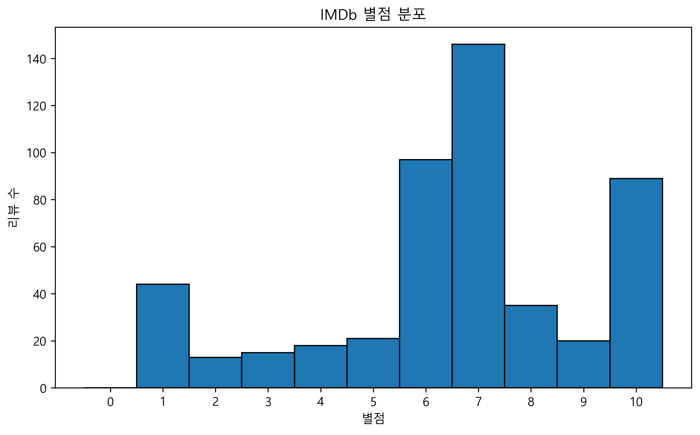

- 총 리뷰 수 : 514개
- 평균 별점 : 6.52점
- 중앙값 : 7점
- 별점 범위 : 1 ~ 10점
- 별점 이상치 : 없음 (0~10 범위를 벗어난 데이터 없음)
- 특징 : 리뷰가 6~8점 구간에 가장 많이 분포하며, 낮은 평점과 높은 평점도 일부 존재함.

##### 리뷰 길이 분포

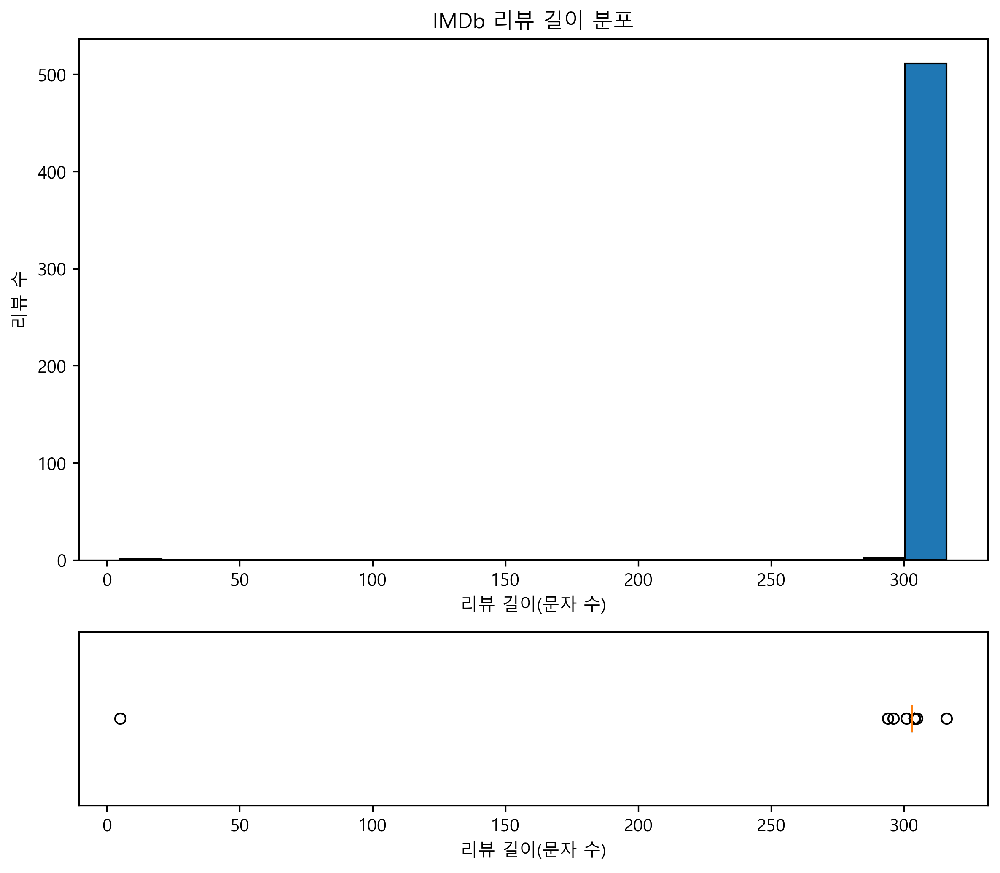

- 평균 리뷰 길이 : 302.44자
- 중앙값 : 303자
- 최소 길이 : 5자
- 최대 길이 : 316자
- 리뷰 길이 이상치 : 18개 (IQR 기준)
- 특징 : 대부분의 리뷰가 약 300자 내외에 집중되어 있으며, 매우 짧은 리뷰가 일부 존재함.

##### 날짜 분포

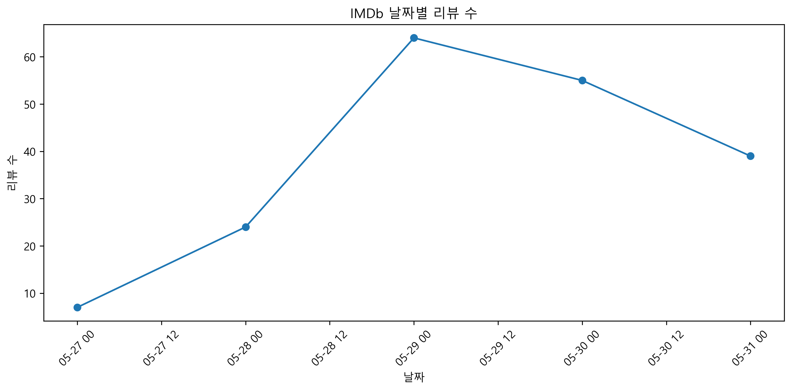

- 리뷰 작성 기간 : 2026-05-27 ~ 2026-05-31
- 날짜 결측치 : 325개
- 미래 날짜 : 없음
- 특징 : 5월 29일에 가장 많은 리뷰가 작성되었으며 이후 감소하는 경향을 보임.

---

#### 2. Megabox

##### 별점 분포

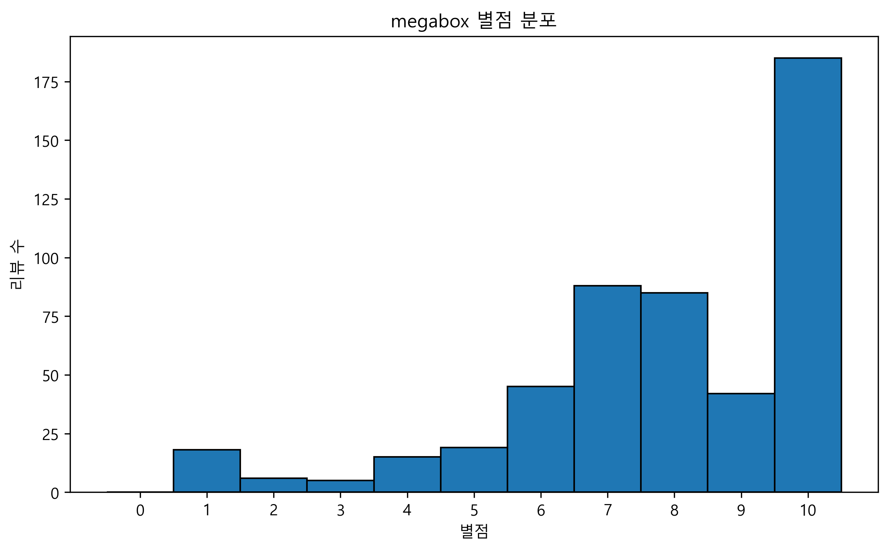

- 총 리뷰 수 : 508개
- 평균 별점 : 7.86점
- 중앙값 : 8점
- 별점 범위 : 1 ~ 10점
- 별점 이상치 : 없음
- 특징 : 7~10점의 높은 평점이 대부분을 차지하여 전반적으로 긍정적인 평가가 많음.

##### 리뷰 길이 분포

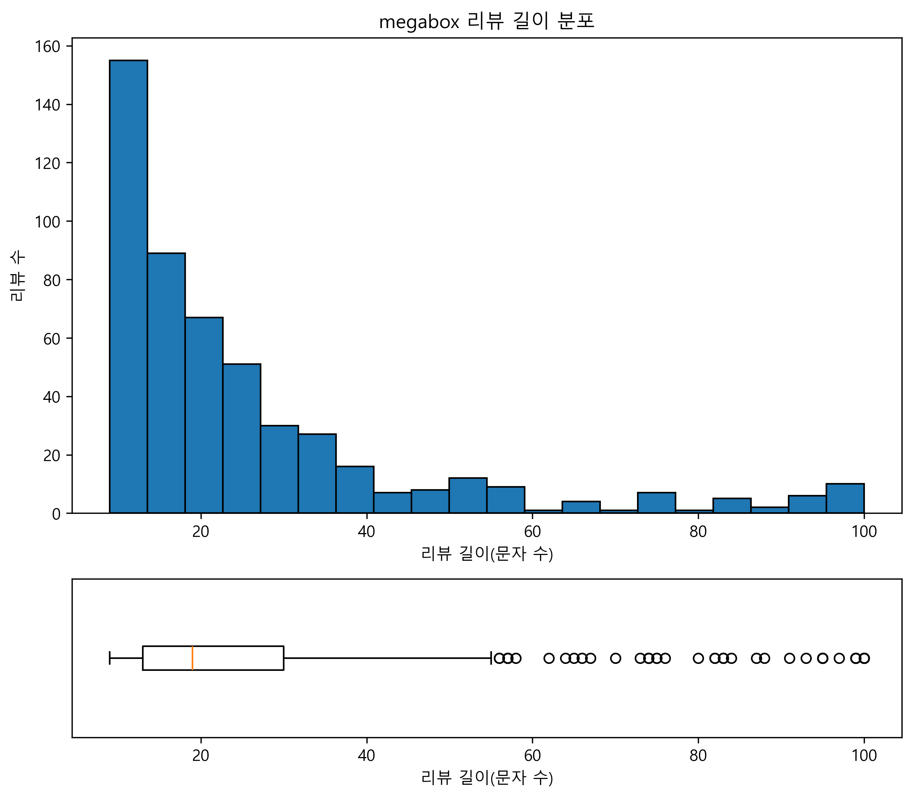

- 평균 리뷰 길이 : 25.95자
- 중앙값 : 19자
- 최소 길이 : 9자
- 최대 길이 : 100자
- 리뷰 길이 이상치 : 44개 (IQR 기준)
- 특징 : 대부분의 리뷰가 10~30자 사이의 짧은 문장으로 작성되었으며, 일부 긴 리뷰가 존재함.

##### 날짜 분포

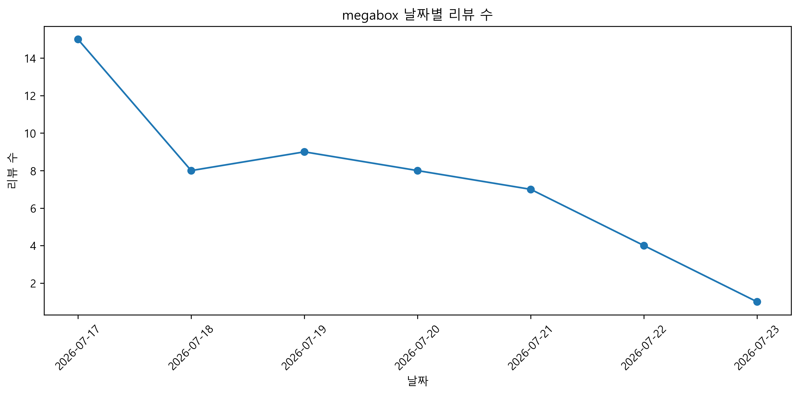

- 리뷰 작성 기간 : 2026-07-17 ~ 2026-07-23
- 날짜 결측치 : 456개
- 미래 날짜 : 없음
- 특징 : 7월 17일 이후 리뷰 수가 점차 감소하는 경향을 보임.

---

#### 3. Naver

##### 별점 분포

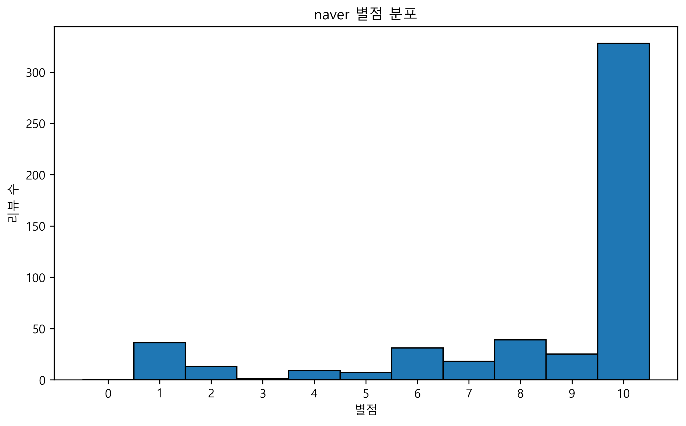

- 총 리뷰 수 : 507개
- 평균 별점 : 8.41점
- 중앙값 : 10점
- 별점 범위 : 1 ~ 10점
- 별점 이상치 : 없음
- 특징 : 10점 리뷰의 비중이 가장 높아 세 사이트 중 가장 긍정적인 평가를 보임.

##### 리뷰 길이 분포

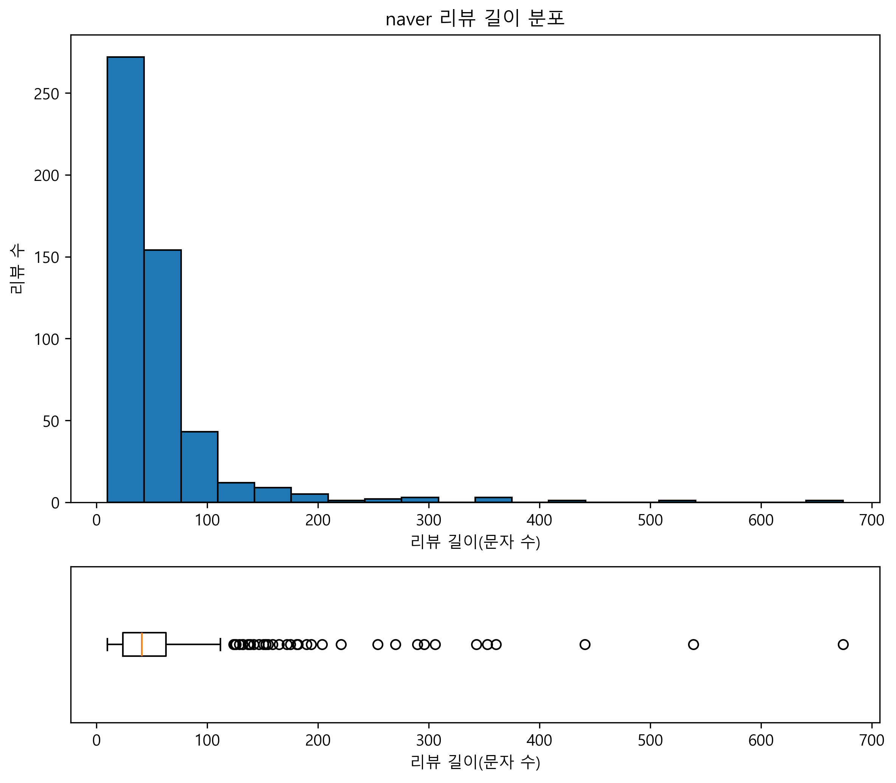

- 평균 리뷰 길이 : 55.62자
- 중앙값 : 41자
- 최소 길이 : 10자
- 최대 길이 : 674자
- 리뷰 길이 이상치 : 37개 (IQR 기준)
- 특징 : 대부분의 리뷰는 20~60자에 분포하지만, 매우 긴 리뷰도 일부 존재함.

##### 날짜 분포

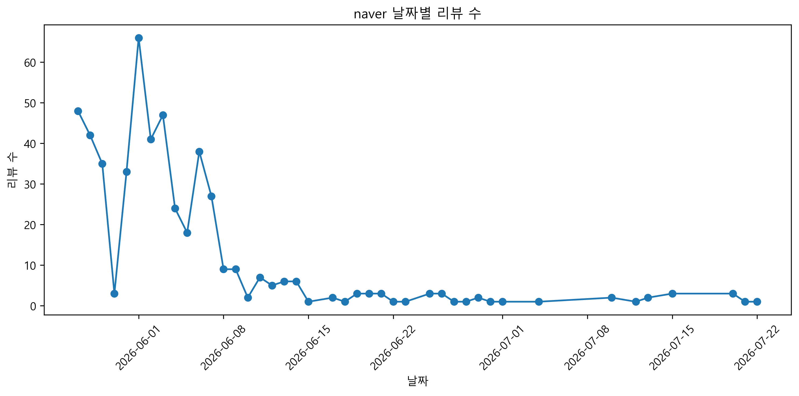

- 리뷰 작성 기간 : 2026-05-27 ~ 2026-07-22
- 날짜 결측치 : 0개
- 미래 날짜 : 없음
- 특징 : 개봉 직후 리뷰가 집중되었으며 이후 리뷰 수가 점차 감소하는 경향을 보임.

---

### 비교분석

전처리가 완료된 `preprocessed_reviews_{사이트이름}.csv` 3개를 기반으로, 사이트간 텍스트 비교와 시계열 비교를 수행하였다.

#### 1. 키워드 빈도 비교 (TF-IDF)

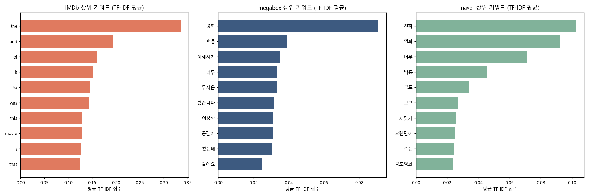

- 각 사이트에서 TF-IDF 평균 점수가 가장 높은 상위 10개 키워드를 비교하였다.
- **Megabox, Naver**는 `영화`, `백룸`, `너무`, `공포` 등 영화 제목·장르·감상 표현 위주의 키워드가 상위에 나타나 리뷰 내용이 뚜렷하게 드러났다.
- **IMDb**는 `the`, `and`, `of`, `it` 등 영어 불용어(stopword)가 상위를 차지했는데, 이는 전처리 과정에서 영어 불용어 제거를 별도로 적용하지 않았기 때문이다. 추후 `nltk`의 영어 stopword 리스트를 적용하면 더 의미 있는 키워드 비교가 가능할 것으로 보인다.

#### 2. 별점(감정) 분포 비교

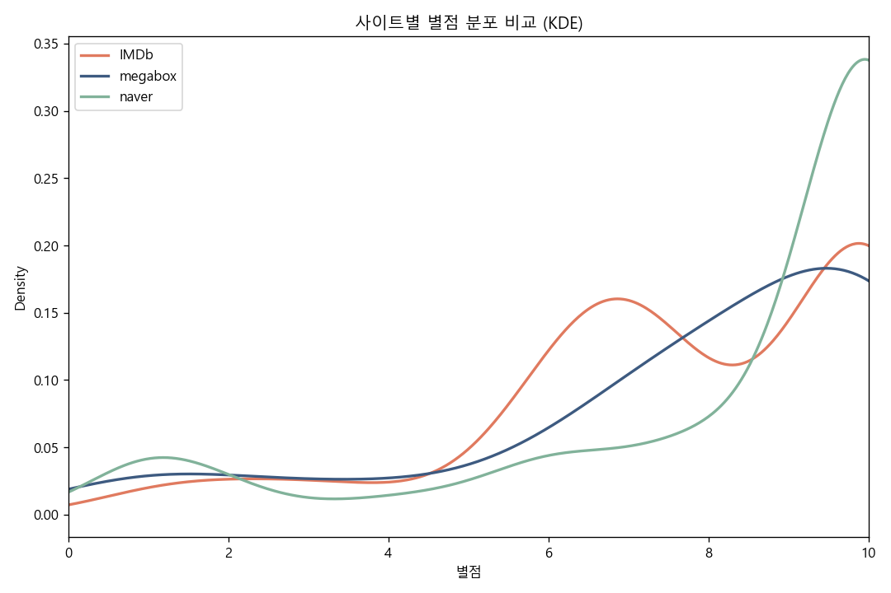

- 세 사이트의 별점 분포를 KDE(커널 밀도 추정)로 겹쳐서 비교하였다.
- **Naver**는 10점 근처에 뾰족한 피크가 있어 매우 긍정적인 평가가 집중된 반면, **IMDb**는 6~8점대에 완만한 피크를 보여 상대적으로 중립적·비판적인 평가가 많았다.
- **Megabox**는 전 구간에서 완만하게 우상향하는 분포로, 극단적으로 낮거나 높은 평가보다는 고르게 분포하면서도 고점(9~10점) 비중이 높은 편이었다.

#### 3. 시계열 비교 (첫 리뷰 기준 경과일)

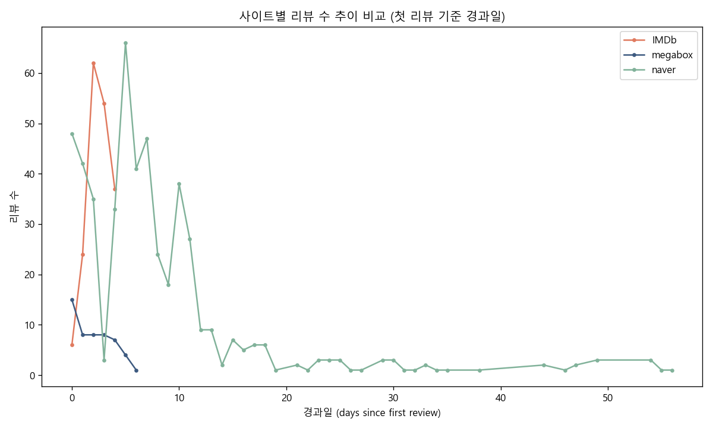

- 사이트별로 실제 작성 날짜대가 서로 달라(IMDb: 5월 말, Megabox: 7월 중순, Naver: 5월 말~7월 말) 그대로 비교하기 어려워, **각 사이트의 첫 리뷰 날짜를 0일로 맞춘 경과일 기준**으로 정규화하여 한 그래프에 겹쳐 그렸다.
- 세 사이트 모두 **개봉 초기 2~7일 사이에 리뷰가 폭발적으로 몰리고 이후 급격히 감소**하는, 전형적인 개봉 직후 리뷰 집중 패턴을 공통적으로 보였다.
- **Naver**는 초기 피크 이후에도 50일 넘게 소량의 리뷰가 꾸준히 이어진 반면, **IMDb·Megabox**는 관측 기간(각각 5일, 7일)이 짧아 초기 급증 구간만 확인할 수 있었다 — 이는 실제 추이 차이라기보다 크롤링 시점/기간의 차이에서 기인한 것으로 보인다.


### github 협업 과제 캡처 이미지

1. **Branch Protection 설정 화면**
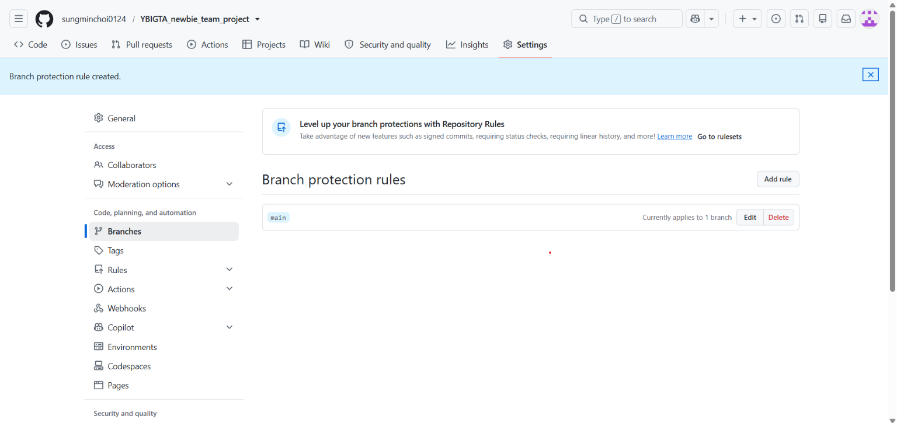

2. **Push 거부 화면**
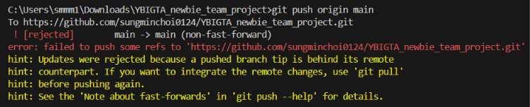

3. **PR 리뷰 및 머지 화면**
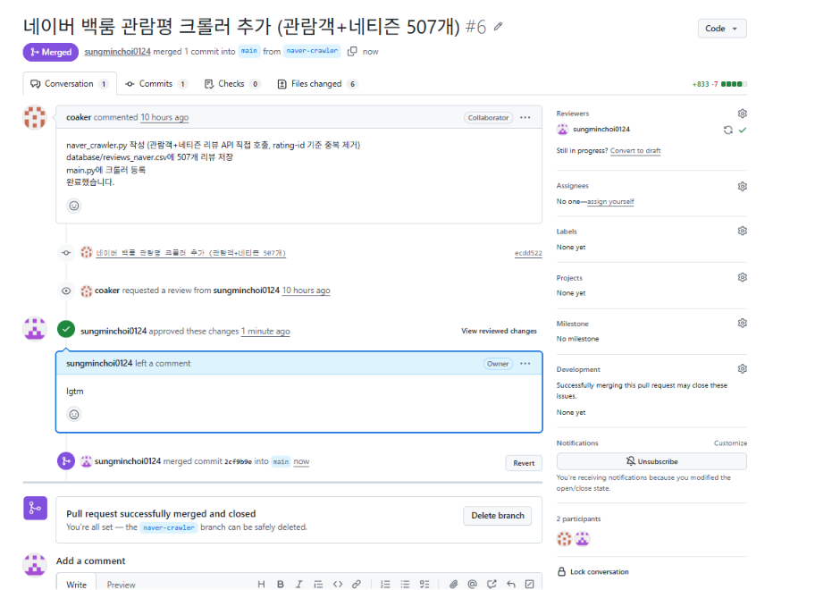


### WEB 과제 실행 방법
1. pip install -r requirements.txt
2. uvicorn app.main:app --reload
3. http://localhost:8000/static/index.html 접속 후 UI 확인


### 팀 소개
* 7조
* 팀장: 최성민
* 팀원: 박소영, 송지훈

### 자기소개
**최성민 (22, 응용통계학과)**
**박소영 (응용통계학과)**
**송지훈 (21, 컴퓨터과학과)**


### AWS endpoint 및 성공 응답 캡처

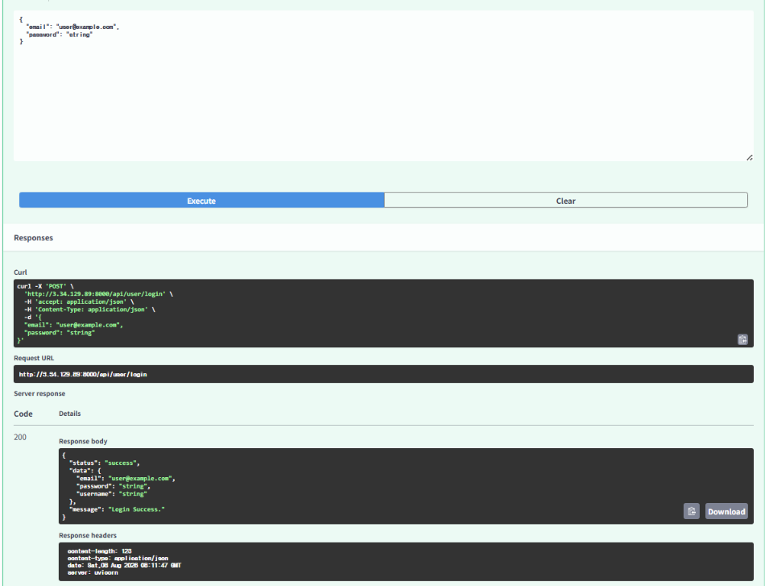

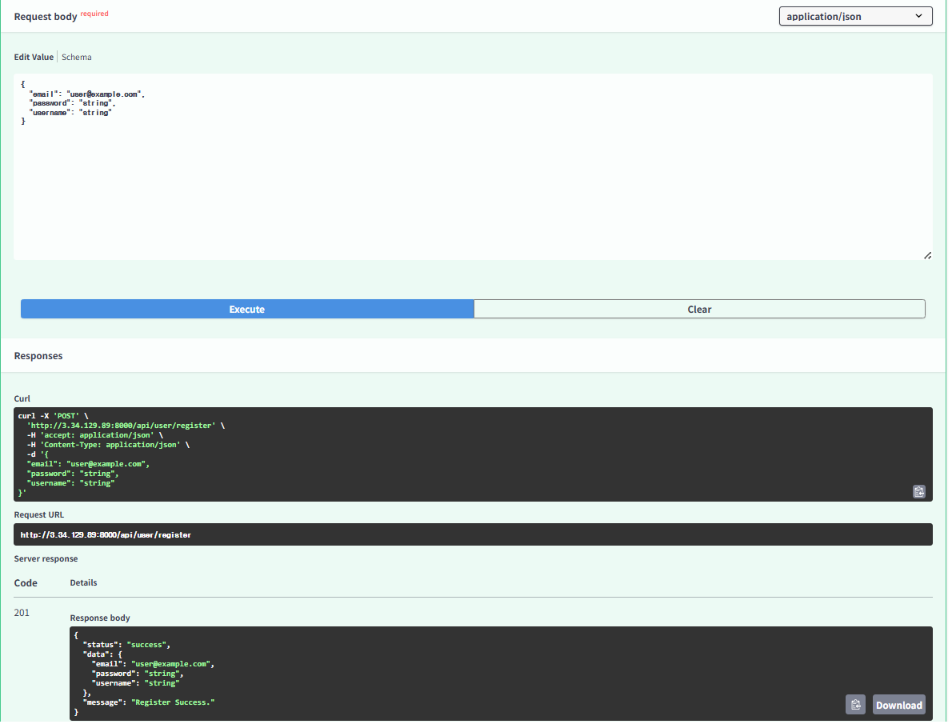


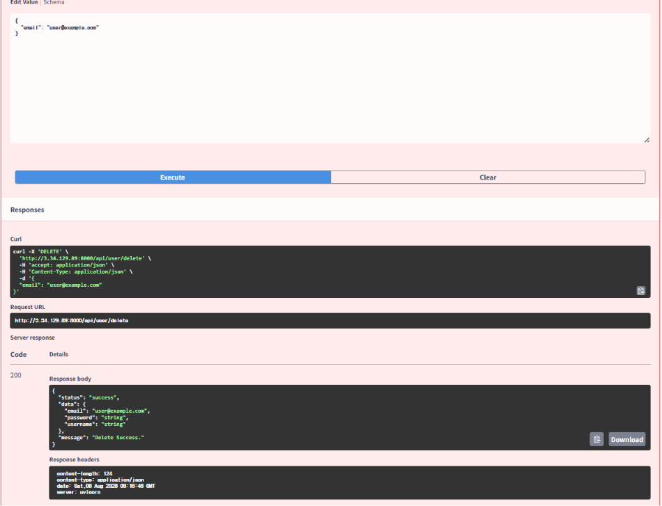

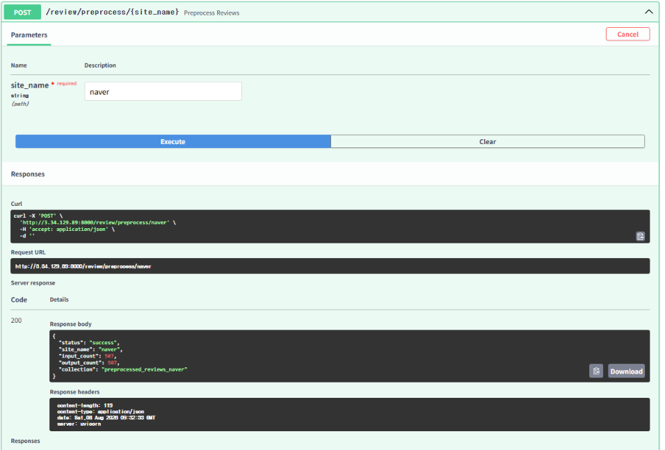
